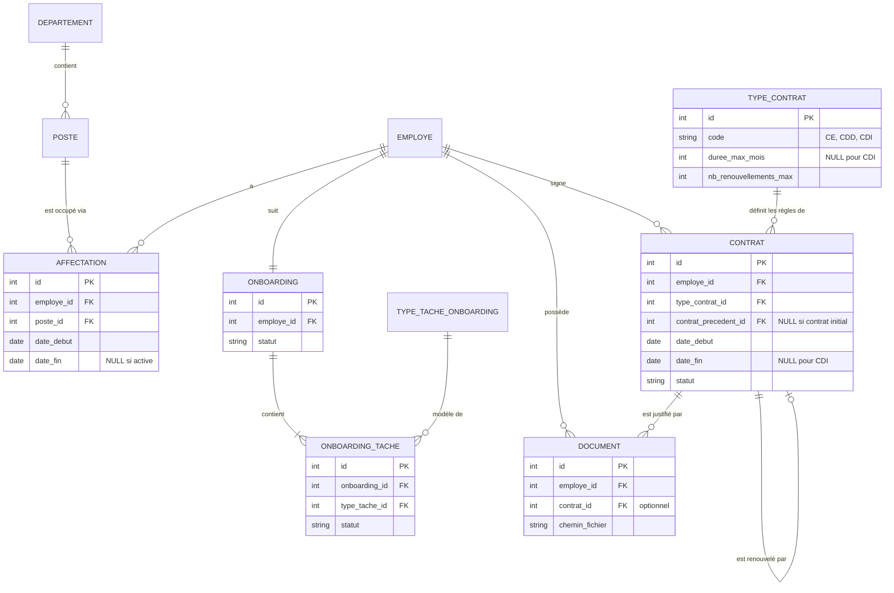

# SIRH Bloc 4 : Modèle conceptuel (diagramme entité-relation)

```mermaid
erDiagram
    DEPARTEMENT ||--o{ POSTE : contient
    POSTE ||--o{ AFFECTATION : "est occupé via"
    EMPLOYE ||--o{ AFFECTATION : "a"
    EMPLOYE ||--o{ CONTRAT : "signe"
    TYPE_CONTRAT ||--o{ CONTRAT : "définit les règles de"
    CONTRAT ||--o| CONTRAT : "est renouvelé par"
    EMPLOYE ||--|| ONBOARDING : "suit"
    ONBOARDING ||--|{ ONBOARDING_TACHE : contient
    TYPE_TACHE_ONBOARDING ||--o{ ONBOARDING_TACHE : "modèle de"
    EMPLOYE ||--o{ DOCUMENT : possède
    CONTRAT ||--o{ DOCUMENT : "est justifié par"

    TYPE_CONTRAT {
        int id PK
        string code "CE, CDD, CDI"
        int duree_max_mois "NULL pour CDI"
        int nb_renouvellements_max
    }
    CONTRAT {
        int id PK
        int employe_id FK
        int type_contrat_id FK
        int contrat_precedent_id FK "NULL si contrat initial"
        date date_debut
        date date_fin "NULL pour CDI"
        string statut
    }
    AFFECTATION {
        int id PK
        int employe_id FK
        int poste_id FK
        date date_debut
        date date_fin "NULL si active"
    }
    ONBOARDING {
        int id PK
        int employe_id FK
        string statut
    }
    ONBOARDING_TACHE {
        int id PK
        int onboarding_id FK
        int type_tache_id FK
        string statut
    }
    DOCUMENT {
        int id PK
        int employe_id FK
        int contrat_id FK "optionnel"
        string chemin_fichier
    }
```
